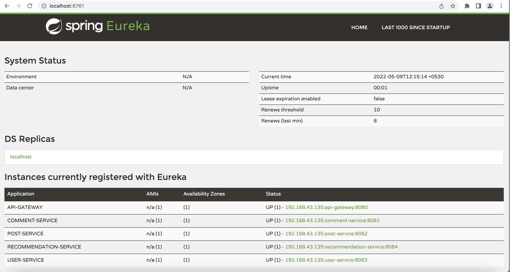
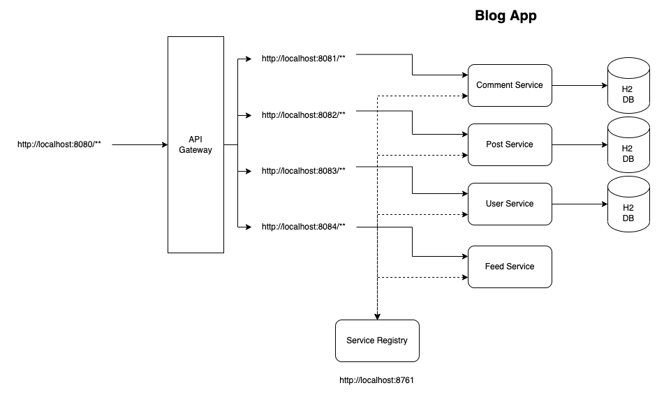
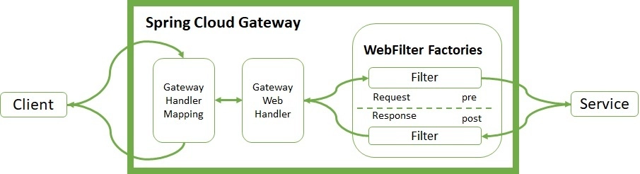
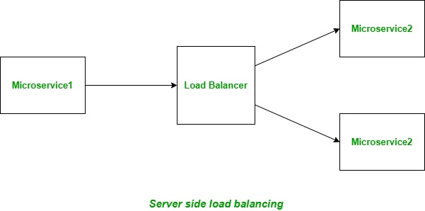
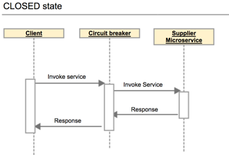
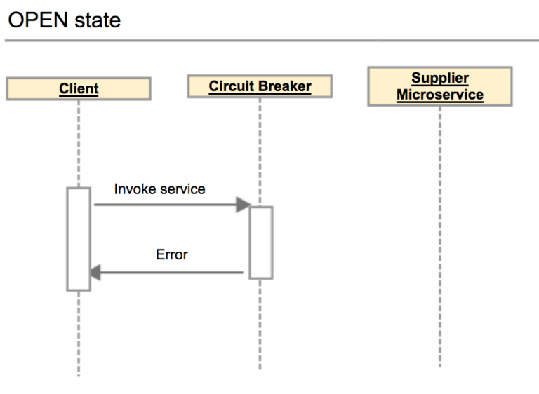
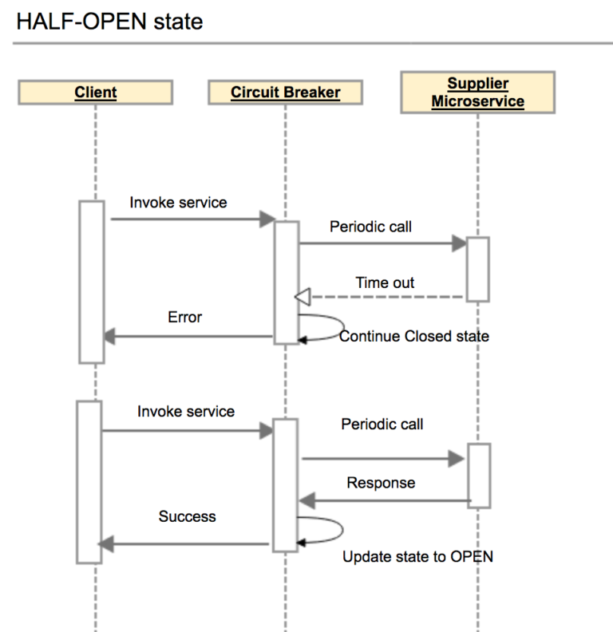

# Blog Application (Microservices)

### End Points

#### API Gateway
> http://localhost:8080/

Circuit Breaker Implemented

#### User Service
> http://localhost:8083/users

#### Post Service
> http://localhost:8082/posts

#### Comment Service
> http://localhost:8081/comments

#### Recommendation Service
> http://localhost:8084/feed

#### Eureka Server
> http://localhost:8761/

### Swagger UI

> http://localhost:port_number/swagger-ui.html

### Swagger API Docs

> http://localhost:port_number/v2/api-docs

### Actuators

> http://localhost:port_number/actuator/info, http://localhost:port_number/actuator/health etc..

## Architecture Diagram

## ER Diagram

## API Gateway

#### Spring Cloud Gateway

## Load Balancer

## Circuit Breaker

#### Resilience4j

##### Closed State

##### Open State

##### Half Open State

### References
* https://www.baeldung.com/spring-cloud-gateway
* https://resilience4j.readme.io/docs/circuitbreaker
* https://spring.io/guides/gs/gateway/
* https://cloud.spring.io/spring-cloud-gateway/reference/html/

### Other Repos

* https://github.com/Deloitte/DynamoDB-REST-APIs-Example.git
* https://github.com/Deloitte/Blog-App-Monolith.git
* https://github.com/Deloitte/Blog-App-Microservices.git
* https://github.com/Deloitte/Blog-App-Microservices-API-Gateway.git
* https://github.com/Deloitte/Blog-App-Microservices-Unit-Integration-Testing.git
